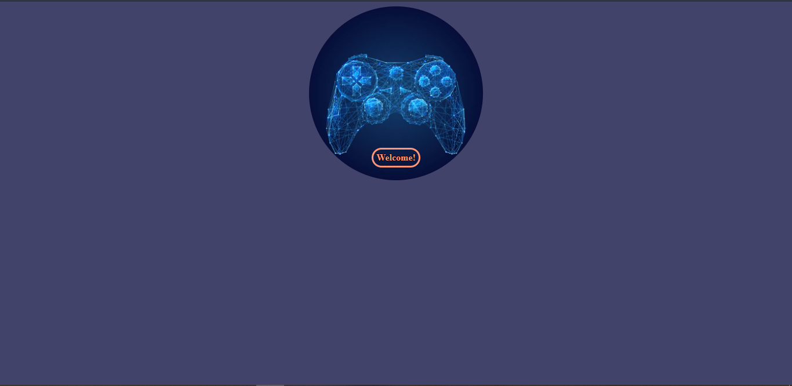
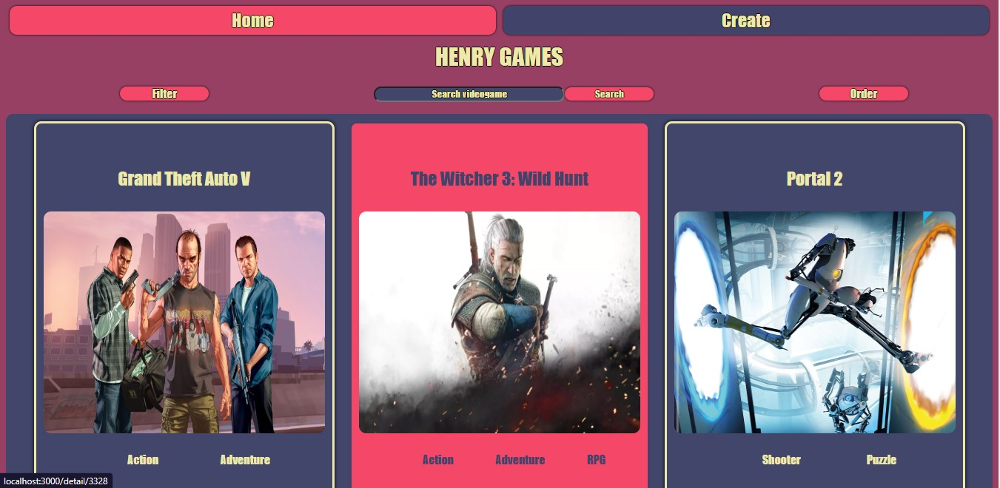
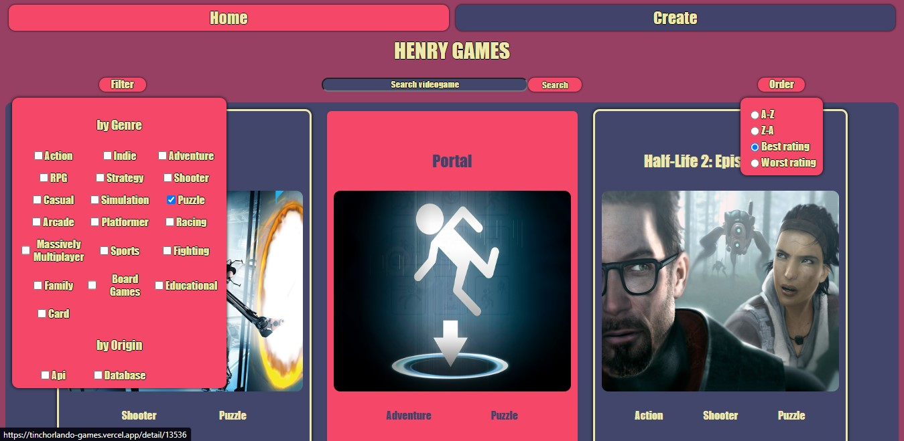
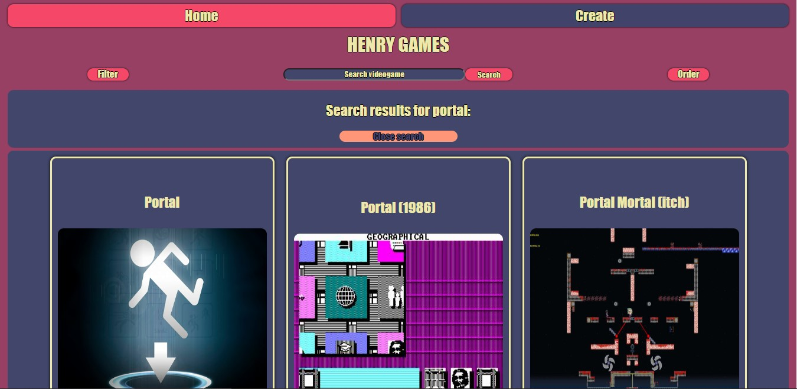
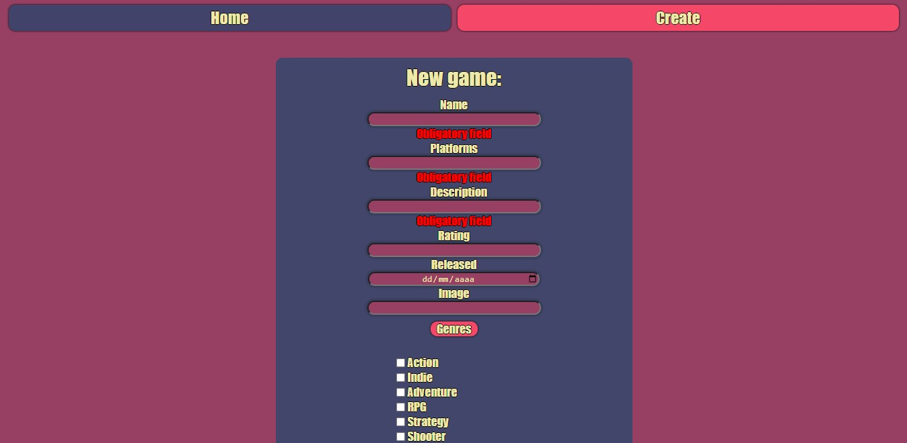

# Proyecto individual - Videogames App
Es un proyecto individual con los objetivos de: 
- Construir una App utlizando React, Redux, Node y Sequelize.
- Afirmar y conectar los conceptos aprendidos en la carrera como Full-Stack Web Developer en Henry.
- Aprender mejores prácticas.
- Aprender y practicar el workflow de GIT.

## Comenzando 🚀


### Pre-requisitos 📋

__IMPORTANTE:__ Es necesario contar minimamente con la última versión estable de Node y NPM. Asegurarse de contar con ella para poder instalar correctamente las dependecias necesarias para correr el proyecto.

Actualmente las versiónes necesarias son:

- __Node__: 12.18.3 o mayor
- __NPM__: 6.14.16 o mayor

Para verificar que versión tienen instalada:

```bash
node -v
npm -v
```

### Instalación 🔧

_El boilerplate cuenta con dos carpetas: `api` y `client`. En estas carpetas estará el código del back-end y el front-end respectivamente.

En `api` crear un archivo llamado: `.env` que tenga la siguiente forma:

```env
DB_USER=usuariodepostgres
DB_PASSWORD=passwordDePostgres
DB_HOST=localhost
API_KEY=yourApiKey
```
Reemplazar `usuariodepostgres` y `passwordDePostgres` con tus propias credenciales para conectarte a postgres
Reemplazar `yourApiKey` con una apiKey personal obtenida gratuitamente en la api externa [rawg](https://rawg.io/apidocs)
Adicionalmente será necesario que creen desde psql una base de datos llamada `videogames`

## Construido con 🛠️

* React
* Redux
* Express
* Sequelize - Postgres

## Funcionalidades 💪
El sitio permite:
- Busqueda de videojuegos por nombre, tomando información de la api externa
- Listado de videojuegos con sus imágenes y géneros respectivos en página principal
- Filtrado activo y combinable por géneros, origen de la información obtenida (solicitado a la api externa o a la base de datos)
- Ordenamiento de la información obtenida según fecha de lanzamiento o orden alfabético
- Creación de juegos al listado, con control de existencia previa en la base de datos
## Imágenes ✨

<p align="center">
  
  
  
  
  
  
  
</p>


